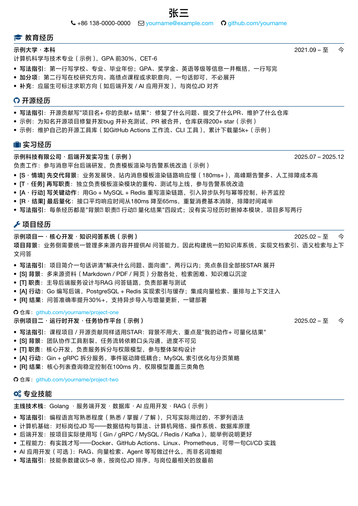

# 简历合集

三个常用简历模板的搜集整理，均采用**中文版式**、单页 A4 写满、示例内容为 **STAR 法则写作指引**（教你怎么填），不包含任何真实信息，可放心公开。

| 模板 | 语言/引擎 | 特点 | 预览 |
| ---- | --------- | ---- | ---- |
| [经典蓝 LaTeX 版](#1-经典蓝-latex-版) | XeLaTeX | 图标章节、蓝色主题，细节精致 | [latex-classic/resume.pdf](./latex-classic/resume.pdf) |
| [简洁风 LaTeX 版](#2-简洁风-latex-版) | XeLaTeX | 后端方向实例，开箱即编译 | [pdf](./latex-simple/resume_backend.pdf) |
| [Typst 版](#3-typst-版) | Typst | 信息密度高，语法简洁，易魔改 | [template/eg.pdf](./template/eg.pdf) |

## 1. 经典蓝 LaTeX 版

> 版式来源：[brucep3/myCV](https://github.com/brucep3/myCV)（基于 [billryan/resume](https://github.com/billryan/resume) 修改）。



特点：10pt 字号、紧凑边距、蓝色主题 `#003E74`、章节标题带 FontAwesome 图标、项目带仓库链接行。

**编译**（需 [TeX Live](https://tug.org/texlive/) 的 XeLaTeX）：

```bash
cd latex-classic
xelatex resume.tex
```

**⚠️ 字体**：本模板使用方正兰亭黑 Pro 与 Helvetica Neue LT Pro 两种**商业字体**，版权原因不随仓库分发（`.gitignore` 已排除）。使用前请自行获取字体并放入 `latex-classic/Font/` 目录：

```
Font/
├── FontAwesome.otf              # FA 4.7 图标字体（免费，SIL OFL，已随仓库）
├── ProGB18030.otf               # 方正兰亭黑 Pro 常规（商业，需自备）
├── ProGB18030-DemiBold.otf      # 方正兰亭黑 Pro 粗体（商业，需自备）
├── HelveticaNeueLTPro-Roman.otf # Helvetica Neue LT Pro（商业，需自备）
└── HelveticaNeueLTPro-Md.otf    # 同上，Medium 字重（商业，需自备）
```

## 2. 简洁风 LaTeX 版

> 版式来源：[job-hunt-copilot](https://github.com/job-hunt-copilot) 的 `resources/resume_template.tex`。

后端开发方向实例，头部信息行 + 分节，浅色主题：


不依赖外部字体（ctex 自带），开箱即编译：

```bash
cd latex-simple
xelatex resume_backend.tex
```

## 3. Typst 版

> 基于 [fky2015/resume-ng](https://github.com/fky2015/resume-ng) 魔改，感谢原作者。


- 写法参见 [`template/teach_you.typ`](./template/teach_you.typ)（带注释的教学模板）
- 直接在 [`template/eg.typ`](./template/eg.typ) 上改成你自己的内容；示例条目为 STAR 写作指引（S 背景 → T 职责 → A 行动 → R 量化结果）
- 没有实习/工作经历时，直接删掉对应模块，项目部分多写两行即可

**编译**（需安装 [Typst](https://typst.app)）：

```bash
typst compile --root . template/eg.typ template/eg.pdf
```

## 致谢

- [brucep3/myCV](https://github.com/brucep3/myCV) / [billryan/resume](https://github.com/billryan/resume) — 经典蓝 LaTeX 版来源
- [job-hunt-copilot](https://github.com/job-hunt-copilot) — 简洁风 LaTeX 版来源
- [fky2015/resume-ng](https://github.com/fky2015/resume-ng) — Typst 版来源

## 许可证

MIT（见 [LICENSE](./LICENSE)）。注意各模板目录可能附带上游各自的许可与字体版权要求，详见对应目录。
