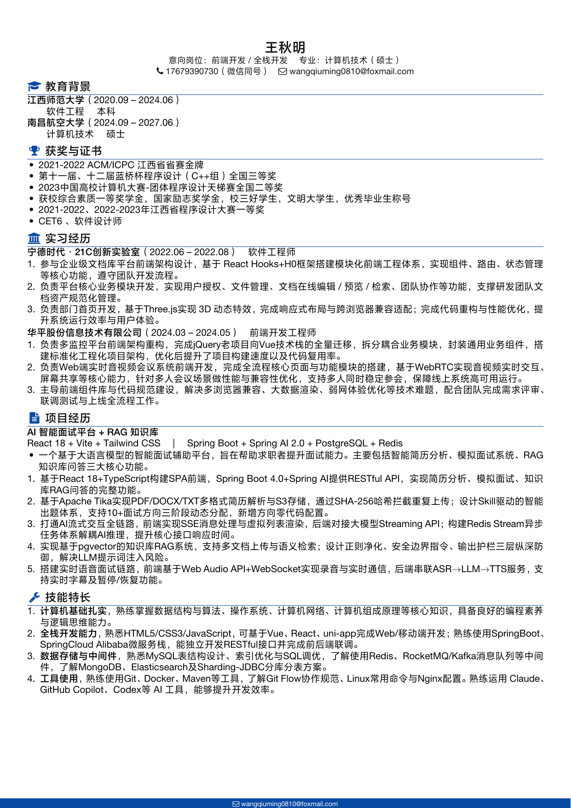

# 简洁风 LaTeX 简历模版 · 后端方向

版式来源 [job-hunt-copilot](https://github.com/job-hunt-copilot) 的 `resources/resume_template.tex`，不依赖外部字体（ctex 自带），开箱即编译。

`resume_backend.tex` 为后端开发方向实例，内容为占位示例，请替换为你的真实信息。



## 编译

```bash
xelatex resume_backend.tex
```

## 自定义

- 头部姓名 / 学校 / 电话 / 邮箱 / GitHub：正文开头信息行
- 主题色：改 `\definecolor{accent}{HTML}{3B5BA6}`
- 章节增删：`\section{章节名}`，条目用 `\entry{标题}{副标题}{技术栈}{时间}`，项目仓库用 `\repo{链接}{URL}`
